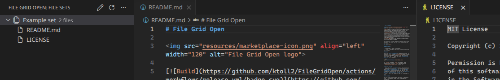
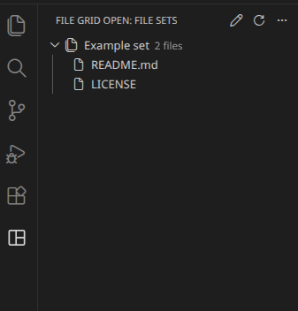
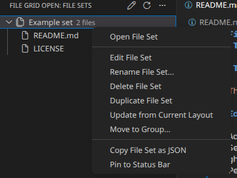
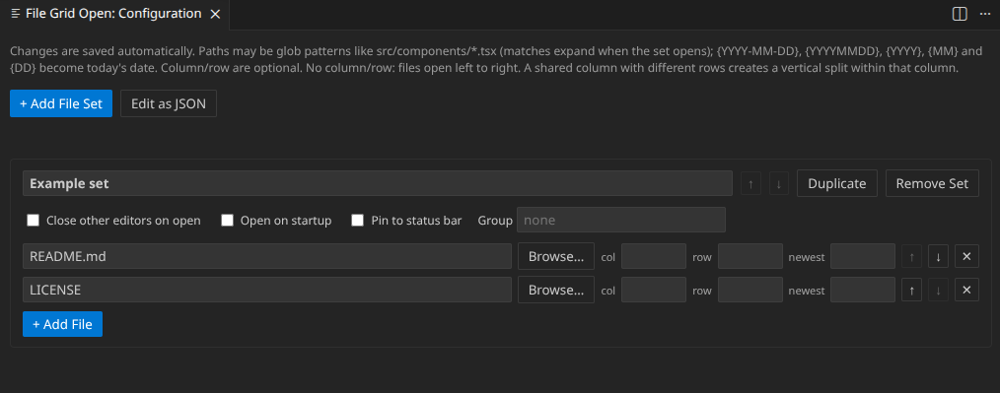

# File Grid Open


[](https://github.com/ktoll2/FileGridOpen/actions/workflows/release.yml)
[](https://marketplace.visualstudio.com/items?itemName=KirkTolleshaug.FileGridOpen)
[](https://open-vsx.org/extension/KirkTolleshaug/FileGridOpen)
[](https://github.com/ktoll2/FileGridOpen/releases/latest)
[](https://github.com/ktoll2/FileGridOpen/releases)
[](LICENSE)

Save groups of files as named sets and open any set side by side in one click, laid out in the columns and rows you choose.

<br clear="left">

## Requirements

- VS Code 1.85 or later (or VSCodium)
- A folder or workspace open, since file sets are stored per workspace

## Install

- **VS Code**: install from the [Visual Studio Marketplace](https://marketplace.visualstudio.com/items?itemName=KirkTolleshaug.FileGridOpen), or search for **File Grid Open** in the Extensions view.
- **VSCodium and other editors**: install from [Open VSX](https://open-vsx.org/extension/KirkTolleshaug/FileGridOpen).
- **From a file**: download the `.vsix` from the [releases page](https://github.com/ktoll2/FileGridOpen/releases), open the Extensions view, choose the `...` menu, and select **Install from VSIX...**. Or from a terminal:

  ```bash
  code --install-extension FileGridOpen.vsix
  ```

  Use `codium` instead of `code` for VSCodium. Each release's notes list the `.vsix` SHA-256 checksum (`sha256sum FileGridOpen.vsix` to check it).

## Getting started

1. Click the **File Grid Open** icon in the Activity Bar.
2. Create a set: right-click a file in the Explorer and choose **Add to File Grid Open Set...**, or use **Edit Configuration** in the view's title bar. You can also arrange your editors the way you like and run **File Grid Open: Save Current Layout as File Set...**.
3. Click a set in the sidebar to open its files side by side.



## The sidebar



Sets are listed in the sidebar and expand to show their files; click a file to open just that file. A file that no longer exists is marked with a warning icon, and its set shows how many are missing.

- **Right-click a set** to open, edit, rename, duplicate, pin to the status bar, update from the current layout, copy as JSON, move to a group, or delete it (with confirmation).
- **Right-click a file** to remove it from its set, or open just that file in a chosen editor group: its configured position, the active group, beside it, or any open group.
- **Groups** are sidebar folders. Use **Move to Group...** to file a set under one, then right-click the folder to rename it or remove it (the sets are kept).
- **Drag and drop**: drag files from the Explorer onto a set to add them, drag sets to reorder them or onto a folder to group them, and drag files within a set or onto another set to move them.
- **Status bar**: a button for the set you opened last, plus one for each set you pinned.

<br clear="left">

## Commands



The set actions in the screenshot are in the sidebar's right-click menu. These commands are in the Command Palette:

- **File Grid Open: Open File Set**: open a set, choosing from a list if there is more than one.
- **File Grid Open: Open Last File Set**: reopen the set you opened last (also a status bar button).
- **File Grid Open: Save Current Layout as File Set...**: create a set from the files open in the editor grid, keeping their columns and rows.
- **File Grid Open: Import File Set from Clipboard**: add sets from JSON copied with **Copy File Set as JSON**.
- **File Grid Open: Edit Configuration**: open the configuration editor.
- **File Grid Open: Edit Configuration (JSON)**: open the raw config file, creating it with a starter example if it doesn't exist.
- **File Grid Open: Refresh**: reload the sidebar.

Save Current Layout and Import are also in the `...` menu of the sidebar's title bar. None of the commands have default keybindings; bind any of them in Keyboard Shortcuts.

<br clear="left">

## The configuration editor



**Edit Configuration** opens a form for your sets. It saves automatically as you type, and **Edit as JSON** opens the raw file for anything the form doesn't cover.

- Add, remove and reorder sets and files with the arrow buttons, duplicate sets, and browse for a path.
- Set each file's `column`, `row` and `newest` (see below). If two files would land in the same cell, the change isn't saved and the conflicting rows are highlighted.
- Per-set options: **Close other editors on open**, **Open on startup**, **Pin to status bar**, and **Group**.
- Duplicate set names get a number appended ("New set 2").
- Paths that don't exist are highlighted. The editor updates itself when the config changes elsewhere.

## The config file

File sets live outside your project, in your user config directory, with one JSON file per workspace named `<folder name>-<short hash of its path>.json`:

- Linux: `~/.config/FileGridOpen/workspaces/` (or `$XDG_CONFIG_HOME/FileGridOpen/workspaces/`)
- macOS: `~/Library/Application Support/FileGridOpen/workspaces/`
- Windows: `%APPDATA%\FileGridOpen\workspaces\`

**Edit Configuration (JSON)** opens the right file for you. To store it somewhere else, set **File Grid Open: Config Path** (`fileGridOpen.configPath`): a relative value resolves against the workspace folder (so you can keep it in the project and commit it), and `~` expands to your home directory. In a multi-root workspace the first folder owns the config, and relative paths resolve against it.

The file is a JSON array of sets:

```json
[
  {
    "id": "61341f68-a226-4422-914f-f752e91a84d8",
    "name": "component with test below",
    "group": "Frontend",
    "pinned": true,
    "paths": [
      { "path": "src/components/Button.tsx", "column": 0, "row": 0 },
      { "path": "src/components/Button.test.tsx", "column": 0, "row": 1 },
      { "path": "src/components/Button.css", "column": 1 }
    ]
  }
]
```

A path can also be written as a plain string (`"src/components/Button.css"`), but the extension saves it back as `{ "path": ... }` whenever it rewrites the file. Optional fields are left out when they aren't set.

| Set field | Meaning |
| --- | --- |
| `id` | Generated automatically (added the first time the file is read); leave it alone |
| `name` | The set's name. Required |
| `paths` | The files, relative to the workspace root or absolute. Required |
| `group` | List the set under a sidebar folder of that name |
| `closeOthers` | `true` closes every other editor before opening the set |
| `openOnStartup` | `true` opens the set when the workspace loads (only the first flagged set opens) |
| `pinned` | `true` shows the set as its own button in the status bar |

| Path field | Meaning |
| --- | --- |
| `path` | The file, or a glob pattern (see below). Required |
| `column` | 0-based horizontal position |
| `row` | 0-based vertical position within the column |
| `newest` | For a glob pattern: open only the N most recently modified matches |

The file is checked when it's read. Invalid JSON, a set without `name` or `paths`, a negative `column` or `row`, a `newest` below 1, or a non-boolean flag shows an error, and the sidebar stays empty until it's fixed.

### Layout

- With no `column` or `row`, files open left to right in the order listed, one per column.
- `column` values are sort keys, not literal slots, so `0` and `2` with no `1` still give two adjacent columns.
- `row` stacks files vertically within a column. Leave it out, or give every file in a column the same row, to keep that column to a single row.
- VS Code allows up to 9 editor groups; extra files are skipped with a warning.
- A set that uses `row` rebuilds the whole editor grid, which closes any other open editor groups in the window. A set that only uses `column` opens new columns alongside whatever is already open.

### Glob patterns and dates

A path containing `*`, `?` or `{` is a glob pattern relative to the workspace, such as `src/components/Button.*`. When the set opens, it is replaced by the matching files (up to 100) in natural order, so `log.2` comes before `log.10`. Files hidden by your `files.exclude` setting aren't matched. Without a `column` the matches go into successive columns; with one they stack as rows in that column, starting at the entry's `row` (or 0). A pattern that matches nothing shows a warning. Brackets aren't special, so `pages/[id].tsx` is a literal name.

Set `"newest": N` on a glob entry to open only the N most recently modified matches, still laid out in name order: `{ "path": "logs/All_*.log", "newest": 1 }`.

Brace groups made only of `YYYY`, `MM`, `DD` and the separators `-`, `_` and `.` are replaced with today's local date before the pattern runs: `{YYYY-MM-DD}` becomes `2026-10-03` and `{YYYYMMDD}` becomes `20261003`. So `logs/All_{YYYY-MM-DD}*.log` matches today's `All_2026-10-03.log` and any rotations like `All_2026-10-03.1.log`. Add a day offset to move the date: `{YYYY-MM-DD-1}` is yesterday and `{YYYYMMDD+7}` is a week from now. Other braces, like `{a,b}`, work as normal glob alternatives.

In the sidebar, a glob entry lists the files it matches right now, with a count ("3 matches", or "1 of 7 matches" when `newest` limits it). The list refreshes when you refresh the view or the config changes, not when files appear on disk.
